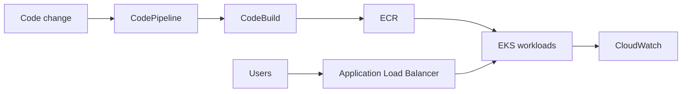

## 프로젝트 개요

전국기능경기대회 클라우드컴퓨팅부문 과제에 맞춰 AWS 관리형 서비스를 활용한 고가용성 아키텍처를 구축한 프로젝트입니다.

## 기술 스택

- AWS VPC
- EKS
- ECR
- ALB
- CloudWatch
- CodePipeline
- ECS

## 문제 인식

- 대회 요구 조건에 맞는 Kubernetes 기반 고가용성 인프라를 제한된 시간 안에 정확히 구성해야 했습니다.
- 네트워크 분리, 트래픽 분산, 배포 자동화까지 포함한 운영 가능 아키텍처가 필요했습니다.
- 코드 변경 시 빌드부터 배포까지 이어지는 컨테이너 CI/CD 파이프라인 구성이 필요했습니다.

## 구현 내용

- VPC를 Public/Private Subnet으로 분리하고 Bastion EC2를 구성했습니다.
- Amazon EKS + Managed Node Group 2개를 구성하고 애플리케이션별 Pod 2개 이상 배포 구조를 만들었습니다.
- ECR에 Docker 이미지를 관리하고 ALB로 트래픽 분산, CloudWatch 모니터링을 구성했습니다.
- CodeCommit/CodeBuild/CodeDeploy/CodePipeline으로 빌드-배포 자동화 체계를 구축했습니다.
- ECS 서비스 배포 자동화와 ALB, Route53 연동으로 엔드투엔드 배포 흐름을 완성했습니다.

## 성과

- 대회 요구사항을 만족하는 AWS 기반 고가용성 아키텍처를 완성했습니다.
- 컨테이너 이미지 빌드부터 ECR 푸시, ECS 배포까지 자동화된 CI/CD 파이프라인을 구축했습니다.
- 운영 가능한 모니터링 및 트래픽 분산 구조를 확보해 실전 대응력을 강화했습니다.

## 핵심 요약

- 대회 요구 아키텍처 완성
- 컨테이너 자동 배포 파이프라인 구성
- 고가용성 운영 구조 구축
