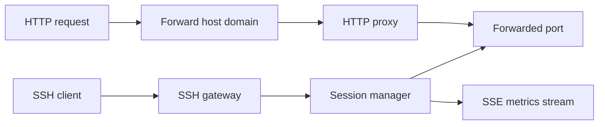

## 프로젝트 개요

SSH remote port forwarding을 웹 도메인 라우팅과 세션 관측 기능으로 감싼 경량 터널 게이트웨이 서비스입니다.

## 기술 스택

- NestJS
- TypeScript
- SSH2
- SSE
- http-proxy-middleware
- Joi
- Docker

## 문제 인식

- 단순 SSH 포트 포워딩만으로는 어떤 세션이 어떤 포트를 열었는지 추적하기 어렵고, 사용자에게 연결 정보를 다시 전달하기도 불편했습니다.
- 도메인 기반으로 터널을 노출하려면 세션별 host 매핑과 내부 포워드 대상 라우팅을 서버가 직접 관리해야 했습니다.
- 운영 중인 터널의 HTTP/TCP 사용량과 오류를 보려면 별도 계측 지점이 필요했습니다.

## 구현 내용

- NestJS 위에 ssh2 서버를 올려 SSH 연결마다 세션을 생성하고, tcpip-forward 요청 시 포트 풀에서 포트를 할당해 동적으로 바인딩했습니다.
- 세션마다 랜덤 forward host를 발급하고 forwardHost.domain 형태의 요청을 http-proxy-middleware로 내부 포워드 포트에 연결했습니다.
- 세션 조회 API와 SSE 이벤트 스트림을 구현해 연결, 포워드 추가·삭제, HTTP 요청 통계를 외부에서 실시간으로 구독할 수 있게 했습니다.
- HTTP 요청 수, 오류 수, 업·다운링크 바이트, TCP 연결 수를 세션 단위로 집계하고 snapshot 이벤트를 debounce해 상태 갱신 부담을 줄였습니다.
- 비밀번호 인증 모드와 무인증 모드를 모두 지원하고, 호스트 키가 없으면 ED25519 키를 자동 생성하도록 구성했습니다.

## 성과

- SSH 포트 포워딩을 단순 네트워크 기능이 아닌 운영 가능한 세션형 서비스로 전환했습니다.
- 세션별 host/port 정보와 요청 통계를 즉시 확인할 수 있어 터널 상태 파악과 디버깅 속도를 높였습니다.
- tunnel.lth.so에서 재사용 가능한 경량 터널 백엔드 기반을 마련했습니다.

## 핵심 요약

- 세션별 랜덤 forward host 발급
- HTTP/TCP 트래픽 실시간 계측
- SSH 인증 모드와 호스트 키 자동 생성 지원
