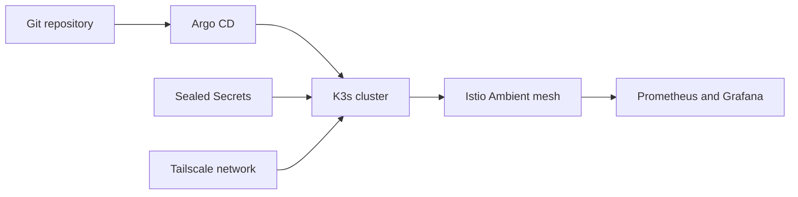

## 프로젝트 개요

Oracle Cloud 기반 K3s 홈랩을 구축하고, GitOps·네트워크·관측 체계를 통합해 운영 자동화를 고도화한 프로젝트입니다.

## 기술 스택

- K3s
- Argo CD
- Helm
- Istio Ambient
- Tailscale
- Prometheus
- Grafana

## 문제 인식

- 수동 배포 중심 운영으로 환경별 설정 불일치와 변경 이력 추적 어려움이 발생했습니다.
- 평문 Secret 관리 방식으로 보안 리스크가 존재했습니다.
- 클라우드/로컬 네트워크가 분리돼 공인 포트 개방 의존도가 높았습니다.
- 리소스/애플리케이션/트래픽 지표가 분리되어 장애 선행 신호를 빠르게 파악하기 어려웠습니다.
- 기존 NGINX Ingress 구조는 장기 운영 표준화와 확장성 측면에서 한계가 있었습니다.

## 구현 내용

- Argo CD Pull 기반 GitOps 파이프라인을 구성해 Git 저장소를 Source of Truth로 전환했습니다.
- Sealed Secrets를 도입해 민감 정보를 암호화 상태로 Git에서 관리하고 클러스터 내부에서만 복호화되도록 구성했습니다.
- Helm 차트로 서비스별 배포 템플릿을 표준화하고 환경별 값을 분리했으며, GitHub PR Actions로 배포 사전 검증을 추가했습니다.
- Tailscale Overlay Network와 Operator, Subnet Route, Split DNS(Technitium + CoreDNS)로 클라우드/로컬 접근 경로를 통합했습니다.
- Prometheus + Grafana + Istio 메트릭 통합으로 관측 체계를 구축하고, NGINX Ingress에서 Istio Ambient 기반 Mesh 구조로 무중단 전환했습니다.

## 성과

- 수동 배포 제거율 95% 이상, 변경 이력 추적률 100%를 달성했습니다.
- Git revert 기반 롤백 시간을 평균 30분 수준에서 약 10분으로 단축했습니다.
- 외부 개방 포트를 80/443 중심으로 축소하고 SSH 접근을 Tailnet 기반으로 표준화했습니다.
- 클러스터/애플리케이션/트래픽 지표 통합 가시성을 확보해 장애 원인 파악 시간을 단축했습니다.
- Ingress 중심 구조에서 Mesh 기반 트래픽 통제 구조로 전환해 운영 일관성과 확장성을 강화했습니다.

## 핵심 요약

- 수동 배포 95% 이상 제거
- 롤백 시간 평균 30분→10분 단축
- 트래픽/리소스 통합 가시성 확보
