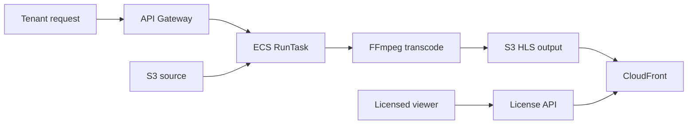

## 프로젝트 개요

영상 업로드 이후 HLS 트랜스코딩과 암호화, 테넌트 단위 사용량 통제를 결합한 컨테이너 기반 처리 서비스입니다.

## 기술 스택

- API Gateway
- ECS
- S3
- CloudFront
- TypeScript
- NestJS
- FFmpeg

## 문제 인식

- HLS 변환/암호화는 CPU·메모리 집약 작업으로 대용량 처리 시 병목 리스크가 컸습니다.
- 입력 포맷이 mp4가 아닐 경우 추가 변환 단계가 필요했습니다.
- ECS Task 종료 후 로그 추적 및 API Gateway 로그 로테이션 한계로 운영 추적성이 낮았습니다.
- 테넌트별 사용량 추적과 유료 콘텐츠 접근 제어를 위한 키 관리 체계가 필요했습니다.

## 구현 내용

- S3 원본 다운로드 후 mp4 여부를 판별하고 필요 시 변환/압축을 수행했습니다.
- FFmpeg 기반으로 HLS 트랜스코딩과 암호화 키 생성/적용을 구현하고 결과물을 S3에 업로드했습니다.
- GitHub -> CodeBuild -> ECR 기반 CI/CD를 구성하고 API Gateway aws service request로 ECS RunTask를 실행했습니다.
- ECS Task Definition(16vCPU/32GB)으로 워크로드 리소스를 명시하고 Usage Plan + API Key로 테넌트 추적 체계를 구성했습니다.
- S3 오리진 + CloudFront 캐싱, License API 권한 제어 엔드포인트를 구축했습니다.

## 성과

- 상시 인스턴스 운영을 제거하고 요청 기반 실행 구조로 유휴 비용을 절감했습니다.
- Usage Plan 기반 테넌트 요청 추적 및 리소스 통제가 가능해졌습니다.
- License API를 통해 유료 콘텐츠 열람 제한을 구현했습니다.
- 컨테이너 기반 워크로드 분리로 서비스 영향도를 낮추고 운영 안정성을 확보했습니다.

## 핵심 요약

- 요청 기반 실행으로 유휴 비용 절감
- Usage Plan 기반 테넌트 추적
- License API로 유료 콘텐츠 접근 제어
