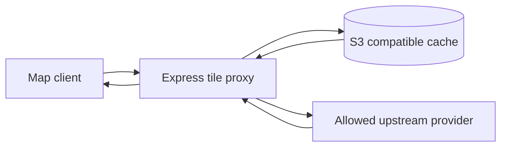

## 프로젝트 개요

지도 클라이언트의 slippy-map 타일 요청을 받아 허용된 upstream provider에서 타일을 가져오고, S3 호환 object store에 저장한 뒤 이후 요청은 캐시에서 응답하는 경량 타일 프록시입니다.

## 기술 스택

- TypeScript
- ExpressJS
- S3
- Docker
- OpenStreetMap
- HTTP Cache

## 문제 인식

- 지도 화면에서 동일 타일이 반복 요청되면 upstream 지도 서버 지연과 rate limit 의존도가 커집니다.
- 타일 origin을 여러 개 운영하려면 route name과 origin allowlist를 명확히 분리해야 했습니다.
- 캐시 hit/miss/stale 상태를 운영 중에 확인할 수 있는 관측 지점이 필요했습니다.

## 구현 내용

- Express 기반 HTTP API로 /tiles/:map/:z/:x/:y.:ext 경로를 제공하고, PROXY_MAPS 설정으로 map 이름별 upstream origin을 allowlist화했습니다.
- S3 호환 object store에 타일을 저장하고 CACHE_TTL_MS 기준으로 fresh/stale 상태를 판단하도록 구성했습니다.
- 캐시 miss 시 upstream에서 타일을 가져와 저장한 뒤 응답하고, stale 캐시는 즉시 응답하면서 백그라운드 refresh를 수행하도록 구현했습니다.
- X-Cache 응답 헤더로 HIT/MISS/STALE 상태를 노출하고, /tiles/:map/:z/:x/:y.:ext/info 엔드포인트로 캐시 메타데이터를 조회할 수 있게 했습니다.
- Dockerfile과 GitHub Actions 기반 빌드 흐름으로 배포 가능한 컨테이너 패키징을 구성했습니다.

## 성과

- 반복 타일 요청을 S3 캐시에서 직접 처리해 upstream 호출량과 사용자 체감 지연을 줄였습니다.
- warm-cache 벤치마크에서 median total time 21.3ms, upstream 883.2ms 대비 약 41.5배 빠른 응답을 확인했습니다.
- 캐시 상태를 헤더와 info API로 확인할 수 있어 운영 중 문제 원인 파악이 쉬워졌습니다.

## 핵심 요약

- S3 호환 타일 캐시
- stale cache 백그라운드 갱신
- warm-cache 기준 upstream 대비 37배 이상 응답 개선
