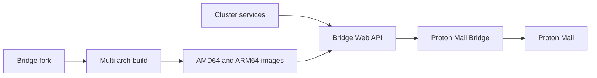

## 프로젝트 개요

로컬 전용 Proton Mail Bridge를 서버형 HTTP API로 확장하고, 멀티 아키텍처 빌드로 ARM 환경까지 지원한 프로젝트입니다.

## 기술 스택

- K3s
- Argo CD
- Docker
- QEMU (multi-arch)

## 문제 인식

- Proton Mail은 보안 구조 특성상 Bridge를 통해서만 SMTP/IMAP 중계가 가능해 클러스터 내부 연동에 제약이 있었습니다.
- 기존 Bridge는 GUI/CLI 중심 로컬 애플리케이션이라 서버 환경 운영에 적합하지 않았습니다.
- 클라우드/ARM 환경까지 고려한 배포 아키텍처 확장이 필요했습니다.

## 구현 내용

- Bridge 코드를 포크해 계정 조회/관리용 HTTP API 엔드포인트를 추가했습니다.
- CLI 애플리케이션을 서버 환경에서 실행 가능한 컨테이너 구조로 전환했습니다.
- QEMU 기반 multi-arch 빌드 파이프라인을 도입해 ARM 이미지 빌드를 지원했습니다.
- 클러스터 내부 서비스 연동 경로를 구성해 SMTP/IMAP 사용이 가능하도록 연결했습니다.

## 성과

- Proton Mail Bridge를 서버형 API 서비스로 전환했습니다.
- 클라우드 내부에서도 E2E 암호화 메일 연동이 가능한 운영 구조를 확보했습니다.
- ARM64 지원을 추가해 배포 대상 환경 호환성을 확대했습니다.

## 핵심 요약

- 서버형 API 전환
- ARM64 지원 추가
- 클라우드 환경 E2E 암호화 메일 연동
