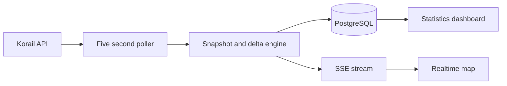

## 프로젝트 개요

코레일 열차 운행 정보를 수집·정규화하고, 실시간 지도와 통계 화면으로 시각화한 철도 관제형 웹 서비스입니다.

## 기술 스택

- React
- TypeScript
- Vite
- Leaflet
- NestJS
- PostgreSQL
- Prisma
- SSE

## 문제 인식

- 열차 운행 정보는 실시간 관제 관점에서 바로 활용하기 어려워, 위치와 지연 상태를 한 화면에서 보기 힘들었습니다.
- 지도 화면과 통계 화면을 동시에 제공하려면 저지연 스트리밍과 시계열 집계를 함께 처리할 백엔드 구조가 필요했습니다.
- 코레일 응답 포맷은 날짜/시간 표현이 불규칙하고, 열차 증감과 위치 변화를 안정적으로 추적하기 위한 정규화 계층이 필요했습니다.

## 구현 내용

- 백엔드에서 코레일 API를 5초 주기로 폴링하고, 열차 스냅샷과 이전 상태 diff를 계산해 생성·변경·제거 이벤트를 분리했습니다.
- 초기 접속 시 최신 스냅샷을 먼저 보내고 이후 델타 이벤트를 이어 보내는 SSE 스트림을 구현해 지도 상태를 효율적으로 동기화했습니다.
- Prisma + PostgreSQL로 열차 스냅샷, 이벤트 로그, 시간대별 통계 테이블을 구성해 실시간 조회와 추세 분석을 함께 지원했습니다.
- React + Leaflet 프론트엔드에서 실시간 열차 위치를 지도에 표시하고, URL 기반 열차 선택과 추적, 다크 모드 전환을 지원했습니다.
- 운행 수, 지연률, 열차 유형별 분포, 역별 활성도와 지연 현황을 차트와 테이블로 구성한 통계 대시보드를 별도 탭으로 제공했습니다.

## 성과

- train.lth.so에서 전국 열차 위치와 지연 상태를 실시간으로 확인할 수 있는 서비스 운영 기반을 마련했습니다.
- 스냅샷/델타 분리 구조로 지도 갱신 시 불필요한 전체 재렌더링을 줄이고, 실시간성 유지와 네트워크 효율을 함께 확보했습니다.
- 실시간 지도뿐 아니라 누적 통계까지 한 서비스에 통합해 운영 현황 파악과 지연 추세 분석이 가능한 구조를 만들었습니다.

## 핵심 요약

- 5초 폴링 기반 실시간 열차 추적
- SSE 스냅샷/델타 스트림으로 지도 동기화
- 역별·유형별 지연 통계 대시보드 제공
